# ratchet-loop

**The agent loop that doesn't trust "I'm done."**

[](https://github.com/antronaut-labs-dev/ratchet-loop/actions/workflows/ci.yml)
[](https://www.npmjs.com/package/ratchet-loop)
[](./LICENSE)

**[60-second try](#60-second-try) · [Use it](#use-it) · [Why](#why) ·
[How it compares](#how-it-compares) · [One attempt](#what-one-attempt-looks-like) ·
[Resumable](#resumable-by-construction) · [Git-safe](#git-safe-by-default) ·
[Bring your own model](#bring-your-own-model) · [API](#api) ·
[What it's not](#what-ratchet-loop-is-not) · [FAQ](#faq) ·
[Docs & contributing](#docs-contributing-security)**

Your coding agent says it finished. The tests are red. `ratchet-loop` runs your
real check — tests, types, build, anything — and keeps the loop going until the
check _actually passes_. The model is the maker. Your check is the judge.
They're never the same thing.

> Vercel AI SDK and OpenAI's Agents SDK stop the loop when the **model** decides
> it's done (`finishReason`, step counts). ratchet-loop stops when **your check**
> decides it's done.



Like a ratchet, the loop only moves forward: every commit is verified progress —
a passing check — and a run can never regress past it.

## 60-second try

```sh
npx ratchet-loop demo
```

Scaffolds a tiny repo with deliberately failing tests and runs the loop live
with a scripted maker (no API key, no install). Watch attempt 1: the "model"
claims it's done, the check says `✗ 2 failing`, and the loop keeps working
until `node --test` is green — then commits. Locally. No push.

## Use it

```ts
import { createLoop, shellCheck } from 'ratchet-loop';

const result = await createLoop({
  goal: 'make the tests in src/auth pass',
  generate: myAgent, // the maker: any model — Claude, GPT, local, whatever
  check: shellCheck('npm test'), // the judge: your real check, evidence included
  maxAttempts: 5,
}).run();

// result.status → 'passed' | 'failed' | 'exhausted'
// result.history → every attempt, every verdict, on disk the whole time
```

`generate` is any async function `(ctx) => Patch`. `ctx` carries the goal, the
full attempt history, and the evidence from the last failing check — everything
the maker needs to do better than last time. `check` is any async function that
returns `{ passed, evidence }`. The core imports **no** LLM provider;
[thin adapters for Anthropic, OpenAI-compatible, and local models](./examples)
live in `/examples` only.

## Why

A loop is a task with a check. The craft is making the check real and never
letting the model grade its own work. ratchet-loop encodes the five rules the
loop-engineering community converged on:

1. **Verifiable goal.** "Done" is a `check()` that returns pass/fail plus
   evidence — test output, compiler errors — not a vibe.
2. **Maker ≠ checker.** `generate` and `check` are separate inputs. The thing
   that writes the code never decides whether it worked.
3. **State on disk.** The agent forgets between runs; the loop doesn't. Every
   attempt is persisted to `.ratchet/state.json` as it happens, so a killed run
   resumes exactly where it stopped — same attempt numbering, same history,
   same budget.
4. **Bounded.** A hard `maxAttempts` ceiling plus an optional USD/turns budget.
   Exhaustion is a first-class result carrying the closest-to-passing attempt —
   never an infinite loop.
5. **Stop-hook.** A self-reported "done" never stops the loop. When the model
   claims success and the check fails, ratchet-loop emits a `claim_rejected`
   event, prints `← model said "done"; check disagreed`, and keeps going.

Rule 5 is the soul of the library. It is also [the signature test](./test/loop.test.ts):
a fake maker claims done, a fake check says otherwise, and the suite asserts
the loop continues. The whole behavior is proven by deterministic tests with
no model anywhere.

## How it compares

One axis matters here: **who decides the loop is done?**

| Tool                  | The loop ends when…                                                                  |
| --------------------- | ------------------------------------------------------------------------------------ |
| **ratchet-loop**      | your external `check()` passes — tests green, compiler clean, exit 0                 |
| Vercel AI SDK         | the model stops emitting tool calls (`finishReason`), or `stopWhen` bounds the steps |
| OpenAI Agents SDK     | the model produces its final output — its own stop signal                            |
| a hand-rolled `while` | whatever the body decides — usually the model's own "done"                           |

These are different jobs, not better and worse tools: the SDKs are full agent
frameworks; this is deliberately not one. ratchet-loop is just the missing stop
condition — you can even run it _around_ an agent built with either SDK, with
your check as the judge.

## What one attempt looks like

```
load state → generate → apply → check → record to disk
                                  │
                        passed? ──┼── yes → commit (local) → stop
                                  └── no  → failure becomes context for the next generate
```

Every step is visible as a typed event (`onEvent`), and the built-in renderer
draws it live — the terminal output at the top of this page is the default,
not a mockup.

## Resumable by construction

State is written atomically after every attempt:

```jsonc
// .ratchet/state.json
{
  "version": 1,
  "goal": "make `node --test` pass in the demo repo",
  "status": "running", // "running" = resumable, even after a crash
  "totals": { "turns": 2, "usd": 0.41 },
  "attempts": [
    {
      "attempt": 1,
      "patchSummary": "reviewed the helpers — everything already looks correct",
      "claimedDone": true, // the model said done…
      "check": { "passed": false, "evidence": "…✗ 2 failing…" }, // …the check disagreed
    },
  ],
}
```

Kill the process mid-run, rerun the same loop, and it picks up at the next
attempt with the full history intact. `maxAttempts` and budgets span resumed
runs — the ceiling is on the task, not the process.

## Git-safe by default

- On a passing check, ratchet-loop makes a **local commit** (`git add -A` +
  `git commit`) in the workdir. That's the ratchet clicking forward.
- **It can never push.** There is no push code path in the library. The option
  is typed `push?: false`, the runtime rejects a truthy value for untyped
  callers, and the test suite proves a passing run leaves a real remote's refs
  byte-for-byte untouched.
- `git: { branch: 'ratchet/fix' }` does the work on a dedicated branch;
  `git: { worktree: true }` isolates the run in a `git worktree` so your
  checkout is never disturbed.
- Not a git repo? The commit is skipped gracefully and the loop still works.

Publishing results stays a human decision.

## Bring your own model

The core is model-agnostic — non-negotiably. See [`/examples`](./examples):

| Adapter                                                   | Covers                                                                                        |
| --------------------------------------------------------- | --------------------------------------------------------------------------------------------- |
| [`anthropic.ts`](./examples/anthropic.ts)                 | Claude, via the official SDK with structured outputs                                          |
| [`openai.ts`](./examples/openai.ts)                       | OpenAI **plus any compatible endpoint** (Kimi, GLM, Gemini-compat, together.ai) via `baseURL` |
| [`local.ts`](./examples/local.ts)                         | Local models through Ollama — no key, no cloud                                                |
| [`fix-failing-tests.ts`](./examples/fix-failing-tests.ts) | The canonical loop: any of the above vs. `npm test`                                           |

An adapter is ~60 lines: build a prompt from `ctx`, call your model, return
`{ summary, files, claimsDone }`. If a "helpful" feature would encode _how_ your
product generates or verifies code, it belongs in your adapter — not in the core.

## API

```ts
const loop = createLoop({
  goal: string,                          // the task, in plain language
  generate: (ctx) => Promise<Patch>,     // the MAKER (any model; you supply it)
  check: (ctx) => Promise<CheckResult>,  // the JUDGE ({ passed, evidence, summary?, score? })
  apply?: (patch, ctx) => Promise<void>, // default: write patch.files under workdir (path-escape safe)
  commit?: (ctx) => Promise<CommitInfo | void>, // default: local git commit on pass
  maxAttempts: number,                   // hard ceiling, spans resumed runs
  budget?: { usd?: number, turns?: number },
  statePath?: string,                    // default: .ratchet/state.json under workdir
  workdir?: string,                      // default: process.cwd()
  git?: { branch?: string, worktree?: boolean, push?: false }, // push can never be true
  reflect?: boolean,                     // ask the maker for a 1-2 sentence self-critique after a failed check
  onEvent?: (e: LoopEvent) => void,      // typed event stream (the renderer consumes the same events)
  silent?: boolean,                      // disable the built-in live renderer
});

const result = await loop.run();
// { status: 'passed' | 'failed' | 'exhausted', attempts, evidence, history, commit?, reason?, closest? }
```

Also exported: `shellCheck(command, opts?)` — turn any command line into a
judge (`passed` = exit 0, `evidence` = real output), `defaultApply`,
`defaultCommit`, `createRenderer`, `RatchetError`, and every type. Strict
TypeScript, zero `any`, dual ESM/CJS, one runtime dependency (picocolors),
~25 kB of runtime code.

### Statuses, precisely

| status      | meaning                                                                                                                            |
| ----------- | ---------------------------------------------------------------------------------------------------------------------------------- |
| `passed`    | The check passed. Work is committed (unless you overrode `commit`).                                                                |
| `exhausted` | `maxAttempts` or a budget was hit. `result.closest` is the best attempt (highest `check.score`, else the last). State is terminal. |
| `failed`    | One of _your_ functions threw. `result.error` says which; state stays **resumable** — rerun to continue.                           |

## What ratchet-loop is not

No prompt library, no context strategy, no AST validation, no model routing,
no multi-stage pipeline, no opinions about how code should be generated or
verified. `generate` and `check` are black boxes you supply. It is a bare,
unopinionated loop engine that refuses to trust the model's "done" — that's
the whole product.

## FAQ

**Isn't this just `maxSteps` / `stopWhen`?**
No — those bound _how long_ the model runs, but the _model's own output_
(finish reason, no more tool calls) still decides success. Here success is
external: nothing the maker returns can stop the loop except by making your
check pass.

**What if the model really is done on attempt 1?**
Then the check passes on attempt 1 and the loop stops in one iteration. A
truthful `claimsDone` costs nothing; only a false one gets called out.

**Why does `failed` keep state resumable but `exhausted` doesn't?**
`failed` means your maker/check/apply threw — an infrastructure problem, so the
run is worth resuming. `exhausted`/`passed` are verdicts about the task itself;
rerunning starts fresh (the old state is reset, with an event telling you why).

**How do budgets know what a model call costs?**
Your `generate` reports it: return `cost: { usd, inputTokens, outputTokens }`
on the patch (the Anthropic example adapter does). The loop accumulates the
totals durably and stops before the attempt that would exceed the budget.

**Windows?**
Yes. Developed on it; CI runs ubuntu + windows on node 20 and 24.

## Docs, contributing, security

- [ARCHITECTURE.md](./ARCHITECTURE.md) — the five principles, the module map,
  and the invariants that keep the core small
- [CONTRIBUTING.md](./CONTRIBUTING.md) — dev setup and the `npm run ci` gate
- [SECURITY.md](./SECURITY.md) — the honest threat surface and how to report privately
- [CHANGELOG.md](./CHANGELOG.md) — what shipped, release by release

Bugs → [Issues](https://github.com/antronaut-labs-dev/ratchet-loop/issues) ·
questions & ideas → [Discussions](https://github.com/antronaut-labs-dev/ratchet-loop/discussions)

## License

[MIT](./LICENSE) © Antronaut Labs
